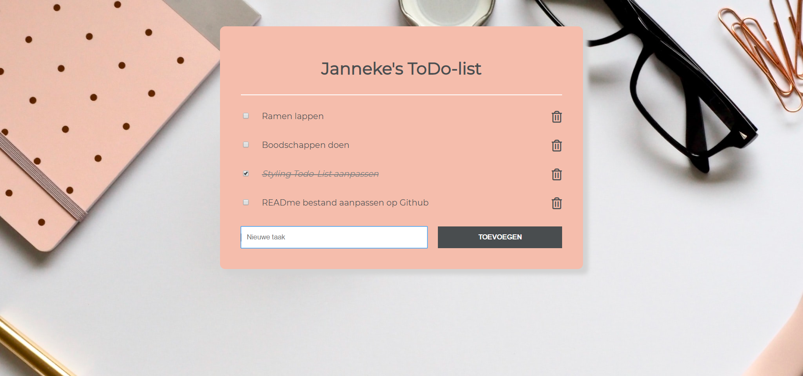

# Project 3 - Todo-List



➙ [Bekijk het project](http://jannekecoumans.nl/html/todo-list/index.html)

##  Doel van het project:
Maak een Todo-list in Javascript, gekoppeld aan een RESTful API database.

## Requirements:
- Als gebruiker wil ik een inputveld zien waarin ik mijn taak in kan vullen.
- Als gebruiker kan ik op een button drukken met de tekst "Add Task" waardoor je ingevulde taak toegevoegd wordt aan de lijst. 
- Als gebruiker zie ik wanneer ik op de add button knop heb geklikt, de taak verschijnen in mijn takenlijst. 
- Als gebruiker kan ik in de takenlijst op een icoontje klikken van een prullenbak, rechts naast de taak, waardoor de taak uit mijn takenlijst wordt verwijderd.
- Gebruik de volgende API-methods: GET, POST, DELETE.

## Bonus Requirements:
- Taak doorstrepen: Als gebruiker kan ik in de takenlijst op een checkbox klikken, links naast de taak, waardoor de tekst van de taak doorgestreept wordt en ik mijn taak kan afstrepen.
- Gebruik API-method PUT om de property van een taak te veranderen zodra de taak wordt doorgestreept.
```
done = false;
```
Wordt veranderd in:
```
done = true;
```
